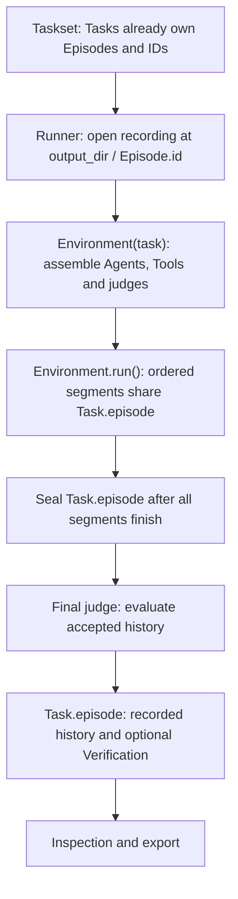

# Seven deep modules for synthetic data generation

Type: specification
Status: resolved
Date: 2026-10-03
Implementation: complete; all five slices implemented and verified

The user authorized execution of this plan. See the [implementation report](implementation.md)
for final measurements, behavioral verification and completed tickets. Historical
proposal/candidate wording below records the design checkpoint; [ADR-0025](../../docs/adr/0025-implement-constructor-bound-environments-and-borrowed-sdk-clients.md)
resolves constructor/run, one-Task-per-execution and SDK adoption as implemented.

## Goal

Users import Task, Runner, Environment, Agent, Episode, Tool and Judge, prepare
Tasks for their use case, and generate reviewed synthetic data directly in Python.
The task-file workflow is optional. This replaces the earlier file-by-file cleanup:
retaining almost every file and shortening its functions is insufficient.

[Measured source baseline](map.md): 28 Python files, 7,401 physical lines and 49
top-level exports. These describe unchanged source, not a claimed reduction.
The user's uncommitted refactor remains the starting point.

## Retained interfaces and integrations

The distribution keeps the following functionality alongside the seven core
generation modules. Preserve the user's existing TUI and vLLM changes, and
simplify the remaining code to use the same core interfaces.

| Kept functionality | Implementation | Uses the core for |
| --- | --- | --- |
| CLI | cli.py | Prepare Tasks and invoke Runner. |
| TUI | ui/terminal.py | Display and navigate recorded Episodes and inspection results. |
| vLLM startup | integrations/vllm/serve.py | Launch/manage a model server; Agent/Judge use the application's inference client. |
| Trace inspection | inspection.py | Read recorded Episodes and expose their history, evidence and verification. |
| Task-file workflow | Replace existing loader machinery with adapters/task_files.py | Prepare the same Task/Agent values used by direct Python callers, preserving supported authoring syntax. |

These are optional interfaces and integrations retained in the package. The
seven-module core describes the generation library, not the entire distribution.
The file dispositions below and implementation slice 5 specify their simplification.

## Core modules and interfaces

```text
agentinstruct/
    __init__.py
    task.py
    runner.py
    environment.py
    agent.py
    episode.py
    tools.py
    judge.py
```

| Module | Responsibility | Small caller interface |
| --- | --- | --- |
| Task | Input, agents mapping with required assistant target and optional user Agent, ordered segments, optional verifier and execution limits; automatically creates its Episode and ID. | Task(agents=..., ...); agents, segments and episode attributes. No execution methods. |
| Runner | Iterate Tasks and open each existing Episode at output_dir / episode.id. | Proposed: Runner(tasks, output_dir=..., client=None, environment=Environment), run() |
| Environment | Take a Task, prepare participants and execute segments into its existing Episode. | Proposed constructor/run interface: Environment(task, client=...), run() -> None |
| Agent | Own its declared Tools and optional reviewer, use review feedback to revise proposals, accept messages and execute approved Tools. | Agent(model, instruction, tools=(), reviewer=None); turn(episode); generate(history) is the custom generation extension point. |
| Episode | Task-owned identity/history across its segments, with accepted messages, evidence and verification. | read-only id and messages attributes; open, append, record, seal; optional serialization/loading operations. |
| Tools | Wrap actual capabilities and validate their input/output. | Tool.call(arguments) |
| Judge | Reusable evaluation of supplied messages against a prompt/Rubric or callable check. | Judge(...), evaluate(messages); the same constructor serves reviewer and verifier roles. |

Task creation must create its Episode and unique ID automatically. The
constructor-bound Environment with no public setup call is the current
recommendation; the user has not explicitly settled removing setup. Runner's
constructor shape below follows that proposal. Constructors,
ordinary result values and read-only properties do not create runtime owners.
Choose Judge as the public name; Reviewer/Verifier describe its per-message and
per-episode roles, not parallel class hierarchies. Small Rubric and judgment
values can live in judge.py without their own modules.

Each Agent carries its own tools and optional reviewer. tools defaults
to an empty collection. Task has no tools field, shared Tool pool or implicit
assignment rule. Environment uses the configured Agents in Task.agents directly.
Agent advertises and resolves Tool calls only against its
own assignments; another Agent's Tools are unavailable unless explicitly declared
on both. Actual Tool capabilities can be shared by explicit reference under their
declared ownership, without sharing pending calls/private results between Agents.

Task does not have a
message_judge field or a global message critic. Task.verifier is the optional
final judge; episode_judge is not another field or alias. During setup, Environment
validates the supplied Agents and their Tools/reviewers and prepares the Task verifier.
Reviewer absence skips judgment for that Agent, retaining local acceptance/Tool
checks. Verifier absence leaves completion unverified.

### Task participant roles

Task.agents keeps the Agent definitions together in one mapping. Its only allowed
keys are assistant and user. The assistant key is required and always identifies
the target Agent; user is optional and may be omitted. Declared entries must hold
Agent instances. The default participant role is assistant, but its Agent must
be supplied; do not invent a default model/instruction or accept a missing/None
assistant. There are no separate Task.assistant or Task.user fields.

Environment runs the assistant alone when user is absent, or the assistant/user
dialogue when present. Mapping keys assign the roles, with no arbitrary participant
names, separate target flag or configurable target identity. Both entries take
the same Agent class, including custom generation subclasses. A subclass,
model backend or domain persona does not create another participant role. Tool
messages and reviewer/verifier invocations also do not create Agent roles.

Each Agent still declares its own Tools and optional reviewer. Only the assistant
may signal Task completion, and training-target selection uses the assistant.
Accepted user messages remain context. Preserve model-specific wire projection
and private Tool visibility; wire roles such as system/tool are not Task roles.
The supplied role is invocation-local, so reusing an Agent does not change its
identity/settings for another Task. No AssistantAgent/UserAgent subclasses are
needed. Participant assignments stay fixed throughout the Task's segments.

### Agent constructor and execution state

Agent(model, instruction, tools=(), reviewer=None) is the directly importable
constructor in agent.py. Task.agents holds these Agent instances under assistant
and optional user keys. Environment uses them directly, without converting a
definition into another Agent. Their mapping keys determine the participant roles.

The constructor holds model, instruction, tools, reviewer and revision settings.
tools defaults to an empty collection, reviewer to None and max_revisions to 1.
max_revisions counts replacement attempts after the original proposal, not total
generation calls. Preserve accept_on_revision_exhaustion=False as an explicit
Agent setting. Opting into that existing fallback can accept an ordinary message
with recorded exhaustion evidence, but cannot authorize rejected Tool calls or
completion signals. These are Agent settings, not Judge settings.

For custom generation, construct an Agent subclass overriding generate(history)
and place that instance under assistant or user in Task.agents. A custom/offline Agent can omit
model. Explicit endpoint dependencies and required output contracts remain named
settings at this seam.

Construction validates local settings without inference, files or live resource
acquisition. Keep configuration stable during execution and snapshot supplied
Tool collections. Agent holds no current Episode, conversation, pending Tool call
or accumulated revision state. Episode owns accepted/private history and recorded
evidence; drafts, feedback and revision counters are local to each turn call.
The same built-in Agent can therefore serve independent Tasks, including concurrent
calls with separate Episodes. Custom generation obeys this rule or callers provide
separate custom instances for execution-specific mutable dependencies.

Environment supplies participant identity, active instructions and its borrowed
client as invocation inputs, without rewriting Agent settings. Model-backed turn
and generate accept an optional client keyword; an explicitly configured Agent
client takes precedence over the shared default. Custom generate overrides accept
the same invocation inputs. Neither Agent nor Episode needs a hidden binding,
clone, reset operation or additional configuration class.

### Reusable Judge constructor

Judge is a directly usable evaluator. Both Agent.reviewer and Task.verifier accept
a Judge instance; ordinary authored settings are translated into this same class.
There is one constructor and evaluation interface, without MessageJudge,
EpisodeJudge, Reviewer/Verifier subclasses, a role flag or binding wrappers.

For model evaluation, construct Judge(client=..., model=..., prompt=...,
rubric=optional_rubric). For deterministic/custom evaluation, construct
Judge(check=..., rubric=optional_rubric). These are alternative evaluation inputs;
reject ambiguous model/check combinations. A model-backed Judge needs its client
and model. Environment can supply Runner.client when translating ordinary Judge
settings; an already constructed Judge keeps its declared dependency without
being patched or rebound to an Environment.

The caller determines the role and supplies invocation messages:

| Placement | Caller | Messages evaluated | Caller applies result |
| --- | --- | --- | --- |
| Task.agents[role].reviewer | Agent.turn | That Agent's accepted visible context plus its current proposal. The proposal is still unaccepted. | Agent accepts, revises or rejects and enforces its revision limit. |
| Task.verifier | Environment.run | Sealed accepted Episode history across executed segments. | Append final Verification without changing generation. |

Judge.evaluate(messages) returns a validated judgment in both cases, including
verdict/criteria and text feedback. For message revision, feedback identifies
what to fix and may suggest edits; the Agent uses it to author the replacement.
Judge does not own revision counters, current proposals, Episode references, mutable
conversation history or accumulated verdicts. Invocation evidence/results belong
to the caller's Episode. Revision limits are Agent settings, not Judge constructor
settings. Evaluation may perform model I/O; it does not commit messages or execute
Agent Tools.

Construct different Judges for different prompts/Rubrics using the same constructor.
When criteria are suitable for both roles, the same Judge instance can be supplied
as reviewer and verifier, including across independent Tasks. Keep configuration
stable and invocation state local; concurrent calls must not mix history/results
or close their borrowed client. A custom callable's own shared dependencies retain
explicit application ownership.

### Message review and revision

Agent.turn first calls generate(history) to produce an unaccepted draft. The
reviewer evaluates the accepted context visible to that Agent plus the draft.
A passing judgment proceeds to local acceptance and durable recording. A failing
judgment supplies actionable revision guidance that the same Agent uses to update
its draft.

For a revision, turn builds a temporary private history containing the accepted
visible context, the rejected draft and its review feedback, then calls
generate(history) again. The built-in Agent and custom overrides receive the same
information through this existing seam. The replacement is reviewed again before
acceptance. Further revisions use the current rejected draft and its feedback,
bounded by max_revisions. Preserve reviewer-error and exhaustion behavior rather
than treating failed/malformed evaluation as approval.

The reviewer provides guidance; Agent authors the revised response. Building the
temporary history commits nothing to Episode.messages or peer observations.
Episode records drafts, judgments and
revision links as Events for inspection under existing visibility rules. Rejected
Tool proposals cause no Tool effects; only an accepted replacement can authorize
its calls. A final verifier records its judgment of sealed accepted history and
does not start this revision loop or rewrite accepted messages.

Task.episode exists immediately after Task construction. Episode creates a unique
UUID-based id during its own construction. Use an instance-specific default
factory, never a shared Episode default. Neither episode nor id is a required Task
constructor argument. Task construction creates empty history in memory without
files, model calls, Tool calls or live resource acquisition.

Task owns the Episode reference; Episode owns its history/recording invariants.
Runner and Environment use this existing Episode without replacing it or changing
its ID. The proposed execution policy treats one Task instance as one execution:
another independent sample constructs another Task from the same definitions.
Reusing a completed Task must not silently reset, append to or overwrite its output.

turn(episode) calls generate(history), then applies review/revision, accepted
message recording and approved Tool execution. It can generate again after Tool
results. generate returns proposals; a model call may itself perform I/O, but
proposal generation does not authorize Tools or commit accepted output. Custom
generation overrides retain the normal turn acceptance mechanism.

episode.messages is the direct, read-only view of accepted Conversation, preserving
the relevant participant/visibility metadata. Drafts and review Events are separate.
Reading messages is not serialization or choosing a training format. Export is
optional conversion/file output when needed, with its existing target/visibility
selection rules; it is not required just to retrieve the conversation.

Environment must have a usable built-in implementation for direct imports.
In the constructor/run proposal, custom Environment classes accept Task and the
injected client and provide run; callers need no
base-class hierarchy. Single-Agent and dialogue behavior stay in this module,
rather than requiring multiple wrappers for the normal workflow.

### Execution flow



These arrows show execution and produced history. Task configuration does not
feed back from Agent. There are no reset or step methods, including private
versions. Conversation scheduling is ordinary iteration inside run().

Runner owns output_dir, normalizes it to a Path, and derives the destination from
the Episode ID already created with Task. The proposed loop is:

```python
for task in taskset:
    task.episode.open(output_dir / task.episode.id)
    environment = Environment(task, client=model_client)
    await environment.run()
    episodes.append(task.episode)
```

Environment has no output_dir constructor argument and does not allocate paths
under an output root. Runner opens the existing Episode for recording before
constructing Environment. A standalone caller opens task.episode at a chosen
path and passes Task to Environment. Episode owns writing at its destination,
including durable acceptance before Tool effects; persistence is not postponed
until Runner receives the result. No recording manager or output settings on Task
are needed.

Environment(task) validates the supplied Agents with their own Tools and optional
reviewers, plus the Task's optional verifier. The constructor performs
no awaited setup, inference or Tool execution. run() performs any asynchronous
resource preparation within its cleanup scope, executes the Task's ordered
segments, seals generation once, verifies the accepted history and returns None.
Task.episode is the output; Runner.run collects those Episodes.
Taskset is simply list[Task].

One Task execution owns one Episode across all its segments. The initial run uses
the exact Episode object and ID observed at Task construction. To generate another
independent sample under the proposed execution policy, construct another Task;
previous results retain their identity/history. Accepted messages, events/drafts,
Tool-call state, reviewer feedback/revision counters and verification records
cannot carry over between Task executions implicitly. Continuing across distinct
Tasks requires explicit input.
Shared client/Tool dependencies keep explicit ownership; conversation state stays
fresh per Task execution. Concurrent executions use separate Task and Environment
instances; a Task and its Episode must not execute simultaneously in two workers.

Episode.open(path) establishes recording before the first accepted append. It
must not replace the ID, reset history, rebind an active/sealed Episode to another
path or overwrite existing output. Opening/recording failures remain explicit.
Saving after generation alone would lose durable intent before Tool effects.

### Segments within a Task

Task.segments is an ordered list of ordinary records, not a new Step/Plan class
or module. With no segments, the base Agent instructions run once. With segments,
Environment prepares the Task once and iterates those records inside run().

Each segment supplies a name and Agent-specific instruction additions. Base
instructions remain; only the current segment's additions are active. When the
next segment starts, its additions replace the previous segment's additions.
Future instructions are not model-visible early, and previous accepted messages
are not rewritten. Model-call evidence retains the instructions actually used.
Instruction keys can name only the assistant or a configured user. Reject unknown
roles or user instructions when user is absent from Task.agents before execution; segments
cannot add participants or switch the target away from assistant.

The same Agents and Episode continue through the segments. Shared accepted
Conversation and each Agent's private Tool exchanges retain their order and
visibility. Drafts remain Events; changing segments does not accept them. Finish
the current turn and its approved Tool exchanges before activating the next
segment. Record segment activation and associate messages/events with the segment.

Segment completion follows the Environment's ordinary conversation completion
policy and configured limits. A segment failure, cancellation or task-wide
truncation stops remaining segments and preserves partial evidence; final grading
cannot promote failed/invalid generation. Do not restore advance_step/complete_task Tools, StepProgress,
TaskContext or a lifecycle framework. Apply Task.verifier once after task-wide
generation is sealed. Per-segment judges, reward aggregation and resume switches
are not needed for the requested shared-history behavior.

[Harbor's multi-step design](https://docs.harborframework.com/core-concepts/tasks/multi-step)
uses ordered steps with instructions and optional verification. Its environment
persists across steps, but conversations restart by default; resuming history is
an option. Here, shared accepted history within a Task is the user's design choice.

### Direct Python usage

#### Model client initialization and ownership

Runner.client is the application's shared asynchronous model API client, not a
new library Client class, a model instance or a conversation owner. It contains
endpoint, credential and network-connection settings. Agents and model-backed
Judges submit their own model names/requests through it; histories stay in Episode.
Runner passes the same client to each Environment, which supplies it to Agents
and to Judges constructed from ordinary settings. Explicitly constructed Judges
use the client supplied to their constructor.

Callable-only generation/evaluation can run with client=None. A model-backed
Agent or Judge must have an explicit usable client before making model requests.

Create the client once in the application's async entry point, before invoking
Runner. The application owns it and closes it after all intended runs finish.
Runner, Environment, Agent and Judge borrow it and must not close it between
Tasks, after a review or when an Environment exits. Resource cleanup releases
execution-owned resources while preserving this outer client lifetime.

The recipe below uses the candidate
[OpenAI Python SDK](https://github.com/openai/openai-python). MODEL_BASE_URL is the
running server's API root; MODEL_API_KEY is its credential configuration. The
SDK supports custom endpoints and async context management. max_retries=0 retains
the current no-retry behavior. Starting a model server remains separate from
constructing this client. The SDK is not currently a dependency: adoption/pinning
await the transport parity checks below. Runner.client is also unimplemented;
the current Runner takes an Environment and prepared records.

The shared-client example uses one inference endpoint, potentially serving
different model names. Different endpoints require separately initialized,
application-owned clients with explicit Agent/Judge dependencies; do not silently
reuse the default client for a participant configured for another endpoint.
Persist sanitized declarations/call evidence, never credentials or client objects.

For Tasks prepared with ordinary reviewer/verifier settings, the application
entry point can own initialization and the complete batch lifetime:

```python
import asyncio
import os
from openai import AsyncOpenAI
from agentinstruct import Runner


async def generate(tasks):
    async with AsyncOpenAI(
        base_url=os.environ["MODEL_BASE_URL"],
        api_key=os.environ["MODEL_API_KEY"],
        max_retries=0,
    ) as client:
        return await Runner(tasks, output_dir="runs", client=client).run()


episodes = asyncio.run(generate(tasks))
```

#### Tasks and a Judge shared between roles

This illustrates proposed constructors, not the current README interface.
Use this async block inside the application's async entry point (or an async
notebook). lookup is an ordinary async function. The same correctness evaluator
is explicitly supplied for message review and final verification.

```python
import os
from openai import AsyncOpenAI
from agentinstruct import Agent, Judge, Runner, Task, Tool

async with AsyncOpenAI(
    base_url=os.environ["MODEL_BASE_URL"],
    api_key=os.environ["MODEL_API_KEY"],
    max_retries=0,
) as client:
    correctness = Judge(
        client=client,
        model="your-judge-model",
        prompt="Check factual correctness and give specific corrections when needed.",
    )
    assistant = Agent(
        model="your-model",
        instruction="Write a worked teaching example for the given topic.",
        tools=[Tool(lookup)],
        reviewer=correctness,
        max_revisions=2,
    )
    user = Agent(
        model="your-model",
        instruction="Act as a learner and ask questions about the worked example.",
    )
    task = Task(
        input={"topic": "fractions"},
        agents={"assistant": assistant, "user": user},
        segments=[
            {
                "name": "draft",
                "instructions": {
                    "assistant": "Draft an example using the given topic.",
                },
            },
            {
                "name": "revise",
                "instructions": {
                    "assistant": "Check the earlier example and correct any mistakes.",
                },
            },
        ],
        verifier=correctness,
    )
    episode_id = task.episode.id
    episodes = await Runner([task], output_dir="runs", client=client).run()

episode = episodes[0]
messages = episode.messages
assert task.episode is episode
assert episode.id == episode_id
```

The first slice must make this kind of example complete, including Rubrics and
per-Agent reviewer=None support. Agent is its own configuration and behavior;
segments and input remain ordinary data. Avoid separate definition/configuration
classes or dependency containers. Prompt/callable
judgment is a real input, not a reason for a hierarchy. Users can override
Agent.generate and supply the constructed subclass in Task.agents under either
supported role. For assistant-only execution, omit the user entry; assistant
remains required and is the target in both cases.
Runner's optional
environment argument is
an ordinary Environment class, not a factory/registry owner; it constructs one
instance per Task, injecting the shared client explicitly.

## Current files: explicit disposition

Absorb only necessary behavior. Do not concatenate old files into enormous new
ones or relocate the entire framework unchanged.

| Current source | Target and deletion |
| --- | --- |
| __init__.py | Expose seven main imports. Small supporting message/judgment values remain with their owners. Remove obsolete root exports. |
| runner.py | Keep the loop; own output_dir, open each existing Episode by ID, construct Environment(task) and collect Task.episode after run. |
| execution.py | Replace with agent.py and environment.py; delete execution.py. |
| tools.py | Keep and simplify to a callable Tool plus local validation; retire the redundant Tool/FunctionTool split. |
| store.py, traces.py, export.py | Replace with episode.py; delete all three. Remove duplicate snapshot/reference/live-record wrappers and the core LocalRunStore owner. |
| review.py, verification.py, quality.py, quality_provider.py | Replace with judge.py; delete all four. Share scoring/model judgment while retaining separate invocation timing. Remove duplicated request/result/call wrappers. |
| providers.py, responses.py, provider_errors.py | Retire the Provider layer and handwritten wire-model copies after client parity checks. Transport is an injected Agent/Judge dependency. Keep necessary translation/error classification with those owners. |
| structured.py | Remove the standalone schema subsystem. Keep required declaration/result checks at Task/Agent/Tool/Judge entry points using validation libraries. |
| data.py | Remove the standalone serialization layer. Keep necessary Task validation and Episode persistence operations with those owners. |
| failures.py | Remove as a shared subsystem. Redaction belongs to Episode; bounded cancellation-safe cleanup belongs to Environment. |
| paths.py | Remove from the core. Output confinement belongs to Episode; authoring-path handling belongs to the optional loader. |
| task_package.py, components.py, seeds.py | Replace with one optional adapters/task_files.py producing list[Task], retaining authored phases as segments within each Task. Delete the three modules and their runtime/registry/Seed owner abstractions. |
| inspection.py | Keep as an optional recorded-Episode consumer; simplify redundant RecordedRun/RecordedTrace wrappers. |
| cli.py | Keep a thin optional entry point over the same imports and Task loader. |
| ui/terminal.py | Retain the user's optional TUI; consume Episode/inspection output. |
| integrations/vllm/serve.py | Retain the user's optional launcher; transport does not require launcher ownership. |
| ui/integrations package __init__.py files | Packaging markers, not domain owners. |

The eight-file core is not a claim that the entire distribution has eight files.
Optional authoring/presentation/integration code is explicit and must also become
smaller; relocation alone is insufficient. No private directory recreating
providers/store/quality/config layers is planned.

## How the implementation becomes smaller

- Eliminate request/response objects that copy model-client types. Prefer an
  injected mature async client or ordinary async callable for custom/offline
  generation, without a new public Provider protocol family.
- Use one Judge mechanism for model or callable judgment. Invocation supplies
  proposal plus accepted context for message review, or sealed accepted history
  for final verification. Agent owns revisions, not Judge.
- Keep one Episode representation. Projection, append invariants, persistence and
  export share it instead of repeatedly converting live records/references/
  snapshots. Supporting message/result values stay small and with their owner.
- Use configured Agents directly, with execution state in Episode and local calls.
  Task creates its Episode/ID automatically; retain both across all its segments.
  Remove empty-object patching, custom
  Agent attribute copying, callback reassignment and inferred transport ownership.
- Delete generic registries, native-provider option models and preparation from
  runtime. A small optional loader produces the Task values direct callers use.
- Use stdlib context management and validation libraries for their actual work.
  Preserve semantic checks they do not provide; do not substitute unchecked
  dictionaries or swallowed errors.

Prove request/history/error/strict-validation parity before adopting and pinning
the candidate SDK shown above. SDK parsing does not replace our acceptance,
privacy or schema rules. Retire framework wire-model copies only after that proof;
ADR-0006's requirement is amended by ADR-0016.

## Design constraints

Follow [ADR-0014](../../docs/adr/0014-use-task-lists-and-task-owned-run-settings.md),
[ADR-0015](../../docs/adr/0015-separate-environment-setup-and-run.md) and
[ADR-0016](../../docs/adr/0016-build-seven-directly-usable-generation-modules.md) and
[ADR-0017](../../docs/adr/0017-use-agent-reviewers-task-verifiers-and-independent-episodes.md), with output ownership in
[ADR-0018](../../docs/adr/0018-runner-owns-the-output-directory.md) and Task-owned
Episodes/segments in [ADR-0019](../../docs/adr/0019-task-owned-episodes-span-segments.md).
Automatic creation/identity follows
[ADR-0020](../../docs/adr/0020-create-an-identified-episode-with-each-task.md).
Agent-owned Tool declarations follow
[ADR-0021](../../docs/adr/0021-declare-tools-on-each-agent.md).
The explicit feedback loop follows
[ADR-0022](../../docs/adr/0022-construct-agent-definitions-and-revise-from-review.md).
The direct Agent constructor and removal of the definition/runtime split follow
[ADR-0023](../../docs/adr/0023-use-agent-directly-and-keep-execution-state-local.md).
The required assistant target and optional user role follow
[ADR-0024](../../docs/adr/0024-use-required-assistant-and-optional-user-task-roles.md).
The constructor/run interface and one-Task-per-execution policy are proposals
that refine earlier setup/run and repeated-instance behavior.

- Primary classes have few meaningful public methods. Every function/method must
  be fewer than 20 inclusive physical lines, including signature/blank lines.
  Keep readable formatting, types and error semantics. Remove unnecessary
  branches/representations before extracting operations. No forwarding wrappers,
  one-line helper chains or compressed code to pass the count. Surface a coherent
  operation that still exceeds the limit rather than silently relaxing it.
- Only the calling Agent's declared Tools may be advertised or executed. Task has
  no tools field, global pool, fallback assignment or compatibility alias. Review
  precedes acceptance/effects; durable intent precedes Tool execution.
- Agent.reviewer is optional and configured per participant. Task.verifier is
  optional final judgment. No task-level message critic or duplicate judge names.
- Task requires its assistant target and optionally takes a user Agent. These are
  the only participant roles; no arbitrary-name mapping or independent target flag.
- Agent combines settings and behavior. Task.agents holds Agent instances directly;
  Episode and local invocation variables isolate execution state. Reusing an Agent
  cannot leak history, drafts, client binding or revision counters between Tasks.
- Revisions receive the rejected draft and actionable reviewer feedback through
  a private history passed to generate; the Agent authors and re-reviews the
  replacement. Draft/feedback never enter accepted messages or peer history.
- One reusable Judge constructor/evaluate interface serves both roles. Keep
  invocation state local, revision policy in Agent, and final result recording in
  Episode; constructing/using a Judge does not bind it to one Agent or Episode.
- The application initializes and closes Runner.client around the whole batch.
  Execution modules borrow it, including on failure/cancellation, without closing
  it between Tasks. Client credentials never enter persisted Task/Episode data.
- Each Task execution owns a fresh Episode, shared across its ordered segments.
  Tasks created from the same definitions and separate executions cannot share mutable conversation,
  review, pending Tool-call or verification state, or mutate a previous Episode.
- Each Task creates a distinct empty Episode with its own stable ID immediately;
  construction is inert. The first execution uses that object/ID unchanged.
- Runner owns output_dir and uses output_dir / task.episode.id for recording.
  Runner opens the existing Episode before execution; Episode records during execution.
  Saving only after run returns would lose the durable intent-before-effects rule.
- Segment instructions become available only when activated; preserve accepted
  history and private Tool visibility across segments. Seal generation once at
  the end of the Task and verify the accepted history across all executed segments.
- Rejected drafts, private Tool history/reasoning and grading-only inputs stay
  outside peer history/default training export. Accepted reasoning required for
  continuation remains exact.
- Final Judge consumes sealed accepted history; failed/invalid generation cannot
  be promoted. No final Judge leaves completion unverified; reverification is
  append-only and generation remains immutable.
- Preserve local JSON/schema checks, safe diagnostics, failure evidence, deadlines,
  cancellation, bounded cleanup and primary-error propagation. Shared resources
  have an explicit owner; no private flags or lifecycle-manager hierarchy.
- Current saved Trace JSON stays readable. Preserve supported assistant/user
  task-file syntax in the optional loader, with explicit migration errors for
  unsupported participant roles or contradictory target declarations. Retired Python imports get migration notes and updated
  callers, without compatibility aliases.

## Implementation slices

### 1. Establish Task, Environment and Runner

Targets: task.py, environment.py, runner.py and the small root import surface.

Write the complete direct example first. Task holds ordinary settings/segments
and configured Agents, and automatically creates its own Episode/ID. Runner
opens that Episode for recording before execution and collects it afterward. The proposed Environment
constructor takes Task plus injected execution dependencies, validates/assembles
the supplied Agents with their own Tools/optional reviewers and Task.verifier locally. run owns any
async preparation/cleanup, schedules segments into Task.episode, seals once and
invokes final verification. No output directory is passed to Environment.
Keep custom structural Environments usable and default Environment directly
constructible. Add no Taskset class, Plan, reset/step methods or factories.

Proof: direct single-Agent/dialogue/custom-Environment calls, ordered two-segment
Tasks with retained accepted/private Tool history, timely instruction activation,
one final verification and task-wide sealing, no later segment after failure,
two Tasks with identical definitions but distinct Episodes/IDs, independent
histories/review/Tool state, stable construction-to-output identity, unchanged
earlier results, distinct output paths, constructor/open/run failure evidence,
no silent reuse/reset of sealed output and shared-client ownership.
Include two Agents with different Tool declarations, omitted/empty tools, and
rejection of a Task-level tools argument without an implicit compatibility path.
Cover assistant-only and assistant/user mappings, missing/None assistant,
unknown roles, contradictory target declarations and user completion rejection.
Prove a custom Agent subclass fits either supported role, and segment instructions
cannot introduce another participant or address an absent user. Training export
must consistently select the assistant while retaining accepted user context.
Exercise an application-owned client across two Environments, including an early
execution failure, without premature closure; verify outer cleanup occurs once.
Use the same Agent in two independent Tasks, including concurrent turns with
different clients/instructions, and a constructed custom Agent subclass. Prove
construction is inert, configuration stays stable and execution state is isolated.
During migration, changed classes live only in their canonical target module;
remove old definitions/imports as callers migrate, without aliases.
Update impacted examples/tests and the necessary Task-file translation in this
slice; do not leave a nonworking skeleton awaiting the later cleanup. Temporary
dependencies on unchanged implementation are removed in the following slices.

### 2. Implement the small Judge and Tool interfaces

Targets: judge.py and tools.py. Replace four quality modules and redundant Tool
wrappers. Implement the same Judge constructor for model or callable evaluation
and accept instances in both Agent.reviewer and Task.verifier. Keep exact weighted verdict
validation and revision feedback. Share evaluation without coupling message
approval to final verification. Local Tool validation covers arguments, strict
JSON results, output schemas and the existing execution-error policy.

Proof: malformed verdicts, rejection/revision exhaustion, different reviewers
per Agent, reviewer=None and verifier=None, task-specific final policies,
per-Agent Tool visibility/resolution, a Tool available to one Agent but forbidden
to another (including reviewer=None), invalid arguments/results and no effects
from rejected proposals. Validate duplicate Tool IDs within an Agent's declaration,
without requiring a global Tool-name registry across Agents.
Use the same Judge instance for review and final verification, across two Tasks,
and with concurrent evaluation calls; demonstrate correct invocation inputs and
no leaked verdict/history/revision state. Also cover distinct role-specific Judges
constructed through the same interface and conflicting model/check declarations.
Check that rejected judgments retain validated, actionable feedback for the
Agent, including guidance to revise a Tool proposal before execution.
Delete retired request-wrapper tests once interface coverage exists.

### 3. Deepen Agent and remove the Provider framework

Target: agent.py. Use the injected client/callable for generation. Keep turn as
the useful deep operation: propose, judge/revise, commit and execute Tools.
Retain custom generation overrides and multi-message proposals. Consolidate
history projection with Episode; record call evidence explicitly for that
invocation, without callback patching.
Generation requests use only this Agent's tools; accepted calls resolve through
that same assignment without a Task-wide lookup.

Delete ProviderRequest/ProviderResponse/control classes, duplicate wire models
and old transport/schema modules after parity proof. Necessary small surface
translation belongs here; do not rebuild the framework in private helpers.
Judge uses the same client dependency without QualityCall. Preserve scripted
offline tasks through ordinary callable generation instead of Agent type flags.

Proof: Responses/Chat Completions, stateless accepted-history requests, ordered
multi-call effects, exact accepted reasoning, refusal/incomplete/error evidence,
strict local output checks, no hidden retries and credential redaction.
Exercise real Agent/Judge calls with an injected offline client.
Use a feedback-dependent generator to prove that a replacement receives both
the rejected draft and reviewer guidance, is re-reviewed and only then accepted.
Verify the same flow for a custom generate override, exhaustion and Tool proposals;
peers and default exports must not see the temporary revision history.

### 4. Make Episode the sole history/recording module

Target: episode.py. Replace store/traces/export and redundant ledger
representations. Each Episode belongs to one Task execution across its segments. Own
append/event/seal invariants, safe persistence, history
projection and direct messages access. Keep format conversion/file output optional.
Generate the Episode ID at construction and open recording separately. IDs and
empty histories exist before execution; opening persistence preserves identity.
Environment does not touch private Episode
lifecycle fields. Verification appends after generation is sealed.

Keep durable intent before effects, storage/publication failure evidence and
historical JSON reading. Error/JSON/path operations live with their actual owner;
delete leftovers instead of creating a utility dump.

Proof: direct read-only messages access, accepted/draft separation, participant
visibility across segments, private/rejected export exclusion, segment provenance,
commit/fsync/seal failure, cancellation
plus persistence failure, immutable generation, append-only judgments, historical
records and safe exports. Test Episode/Agent/Environment outcomes, not helpers.

### 5. Finish deletion and optional adapters

Targets: adapters/task_files.py and existing optional CLI/inspection/TUI/vLLM code.

Replace TaskPackage/Seed/registry machinery with plain Task preparation.
Keep compile/validation inert, render authored phases into Task.segments rather
than separate Tasks, retain ordinary provenance, and keep source/individual-record
failures distinct. Validate/render all segment definitions before execution while
revealing their instructions only at activation. Retire old Python imports explicitly;
migrate shipped examples to the direct modules or plain loader.

The existing task-file Tool catalog is authoring syntax only. Resolve each
Agent's authored Tool names into its own tools definition; emit no Task-level
tools field or runtime pool. Emit configured Agent instances using the same constructor
as direct callers. Preserve inert validation and explicit assignments.
Translate [agents.assistant] and optional [agents.user] into Task.agents under
those same keys.
Existing target flags may be read only when consistent with those fixed roles;
emit no configurable target flag in the core. Reject other role names and user
targets explicitly, rather than dropping participants or silently reassigning them.
Historical Trace records retain their stored identities/target metadata when read.

Optional consumers use Episode loading/export and the same core interface.
Keep the user's TUI/launcher edits, then simplify their remaining cohesive
operations under the same line limit. Remove dead imports/files/dependencies.
Update README to the implemented interface only when the code actually exists.

Proof: direct/task-file examples offline, compile/import isolation, historical
Trace inspection, CLI, TUI navigation and launcher ownership. Rebase old lean-core
tickets; do not run deleted-module test commands.

## Completion criteria

- CLI, TUI, vLLM startup, Trace inspection and the optional Task-file workflow
  remain available and use the same core interfaces. Preserve existing TUI/vLLM
  edits while simplifying their remaining code.
- The direct example imports seven main names and works without TaskPackage,
  Seed, ProviderRequest, Reviewer factories, separate Agent definitions or a Run store.
- Every Task has its required assistant target and optional user Agent. No other
  role, user-only execution or separate target selection is accepted.
- Each Agent owns tools and its optional reviewer; Task has no tools
  field. Each Task has its optional verifier, and
  each Task execution owns a distinct Episode shared across its segments.
- The same Judge constructor supports message and Episode evaluation; an
  appropriately configured instance is reusable across roles and independent Tasks.
- The Agent uses reviewer feedback and its rejected draft to produce a replacement,
  re-reviews it, and records only accepted messages in the Conversation.
- Client initialization/ownership is explicit in the direct example. The client
  stays open for all borrowed use and closes only in the application's outer scope.
- Task.episode and its ID exist at Task construction and survive execution unchanged.
- Task.episode is the output; the proposed Environment(task) borrows it and run returns
  None. Instructions activate in order, history continues, and final verification
  sees sealed accepted history across all executed segments.
- output_dir is a Runner argument; each execution records to its own destination.
- Old modules in the disposition table are removed, not copied into private
  mirrors. Report optional files separately from the seven-module core.
- Functions/methods stay below 20 lines through reduced concepts and meaningful
  operations. Measure private helpers too, without decorator games.
- Replace retired interface tests with behavioral tests at new imports;
  reorganize test_lean_runner.py by owner. Preserve meaningful privacy/effect/
  storage/cancellation assertions rather than every old test shape.
- Run focused suites per slice, then full offline tests, Ruff and strict mypy
  with .venv/bin on PATH. At completion run lock/build/wheel-import and offline
  examples. Live inference is not needed for core refactoring.
- Record total/core/optional lines, files, classes and exports against the baseline.
  Separate deletion from relocation and count added private helpers.
  No unmeasured final line-count promise is made.
